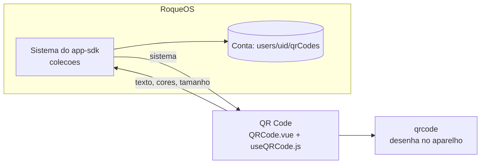

# QR Code

O QR Code do [RoqueOS](https://roqueos.com.br): gera o código de um link, de uma rede Wi-Fi, de
um e-mail, de um telefone, de um SMS ou de qualquer texto, com a cor do código, a cor do fundo e
o tamanho que você escolher, e baixa, copia ou compartilha a imagem. **O código é desenhado no
próprio aparelho**: o texto não vai para serviço nenhum. Com a conta, cada código gerado entra
num histórico que volta em qualquer aparelho. Nos dez idiomas do RoqueOS.

Use de graça em [roqueos.com.br](https://roqueos.com.br), no computador, no celular e na TV.

_English below._

## Por que existe como repo

O QR Code nasceu dentro do RoqueOS, que é fechado. Em 28/09/2026 ele saiu para o próprio
repositório na organização [roqueos-apps](https://github.com/roqueos-apps). O RoqueOS o instala
por uma tag, como dependência git, e ele fala com o RoqueOS só pelo
[`app-sdk`](https://github.com/roqueos-apps/app-sdk). A tela é feita com o kit
[`ui`](https://github.com/roqueos-apps/ui). O mesmo código roda dentro do RoqueOS, sozinho no
navegador (`yarn dev`) e no teste.

A saída consertou uma coisa: o QR Code de antes pedia a imagem a um serviço de terceiros
(`api.qrserver.com`) com o texto no endereço, e guardava esse endereço no histórico. A senha de
um Wi-Fi em QR passava por fora. Agora quem desenha é o pacote
[`qrcode`](https://github.com/soldair/node-qrcode), no navegador, e o histórico guarda só o texto
e as escolhas.

## Arquitetura



```text
app.json            quem ele é: id permanente (qrcode), nome e descrição nos dez idiomas,
                    ícone, cor, janela, a capacidade e a coleção que ele abre
i18n/<idioma>.json  os textos da tela, um arquivo por idioma
src/
  index.js          definirApp: cria o app Vue próprio dentro do elemento que o RoqueOS dá
  QRCode.vue        a tela: prévia, ações, formulário, histórico e confirmação
  useQRCode.js      o motor: gerar, o histórico na conta, baixar, copiar, compartilhar
  qr.js             o que não depende de tela: tipos, a imagem, os campos do histórico, ordem
  textos.js         carrega o JSON do idioma (com ?raw) e traduz uma chave
  qr.scss           o visual
dev/main.js         o yarn dev: o QR Code numa janela falsa do RoqueOS
test/               Vitest: o app pelo SDK, a lógica e a troca de idioma
```

### Como ele fala com o RoqueOS

Só pelo `sistema` do SDK, e a capacidade opcional está no `app.json`:

- `colecoes`: a coleção `historico`, que o RoqueOS guarda na conta da pessoa, no mesmo lugar de
  antes (`users/{uid}/qrCodes`). Cada entrada tem `text`, `size`, `fgColor`, `bgColor` e
  `preset`, os nomes de antes, e a data é do sistema (`criadoEm`). O histórico de quem já usava
  continua valendo; os campos que o app de antes gravava a mais (a URL do terceiro e os dados da
  conta) ficam onde estão e não são lidos.
- `idioma`, `desempenho`, `avisar` e `metricas` (os eventos `qr_generate` e `qr_download`).

Sem conta, o código aparece do mesmo jeito; só não entra no histórico, e o app avisa.

### O que cada botão faz

- **Baixar**: o PNG, com o nome `qrcode-<data>.png`.
- **Copiar**: a imagem, onde o navegador copia imagem; onde não copia, o texto do código.
- **Compartilhar**: a folha de compartilhar do aparelho com o PNG; onde o aparelho não
  compartilha arquivo, copia.
- **Tipo**: põe no campo um modelo de link, e-mail, telefone, Wi-Fi ou SMS, com exemplos no
  idioma da pessoa.
- **Histórico**: as 50 mais novas, com a miniatura desenhada no aparelho. Abrir uma entrada
  volta o formulário e desenha o código sem criar outra entrada. Limpar pede confirmação.

## Pré-requisitos

- Node 22 ou mais novo (o `.nvmrc` diz 24).
- Yarn 1.22.

## Como rodar

```bash
yarn install --ignore-scripts
yarn dev          # o QR Code numa janela falsa do RoqueOS, numa conta local
yarn verificar    # lint, formato, testes e app check: o mesmo do CI e do pre-push
yarn test         # só os testes
```

Na janela do `yarn dev` o histórico fica no `localStorage` e continua depois do F5.
`?idioma=ar-AR` abre em árabe, `?leve=1` como o aparelho fraco vê e `?convidado=1` sem conta.

## Contribuir

Leia o [CONTRIBUTING.md](CONTRIBUTING.md). Todo commit leva `Signed-off-by` (DCO), e o CI
confere. Falha de segurança vai pelo [SECURITY.md](SECURITY.md), nunca por issue pública.

## Créditos e licença

[MIT](LICENSE). Os ícones são do [Material Icons](https://fonts.google.com/icons)
(Apache-2.0), pelo kit de interface; veja o [ASSETS.md](ASSETS.md). O código é desenhado pelo
[qrcode](https://github.com/soldair/node-qrcode) (MIT). "QR Code" é marca registrada da DENSO
WAVE. O nome e a marca RoqueOS são da LEVELHARD e não fazem parte da licença.

---

## English

The QR Code app of [RoqueOS](https://roqueos.com.br): makes the code for a link, a Wi-Fi
network, an email, a phone number, an SMS or any text, with the code color, background color
and size you pick, and downloads, copies or shares the image. **The code is drawn on your own
device**: the text is never sent anywhere. With an account, every code you make goes into a
history that follows you across devices. In all ten RoqueOS languages.

It moved out of the closed RoqueOS core on 28/09/2026 into its own repository in the
[roqueos-apps](https://github.com/roqueos-apps) organization. RoqueOS installs it by tag, and it
talks to RoqueOS only through the `sistema` of
[`@roqueos-apps/app-sdk`](https://github.com/roqueos-apps/app-sdk): `colecoes` (the history, in
the same place as before), plus language, light profile, notices and metrics. The move fixed a
privacy issue: the old app asked a third-party service (`api.qrserver.com`) for the image, with
the text in the URL, and stored that URL in the history. The image is now drawn by the
[`qrcode`](https://github.com/soldair/node-qrcode) package in the browser.

Run `yarn install --ignore-scripts`, then `yarn dev` (a fake RoqueOS window with a local
account) or `yarn verificar` (what CI runs). Every commit must be signed off (DCO). Licensed
under [MIT](LICENSE); icons are Material Icons (Apache-2.0). "QR Code" is a registered trademark
of DENSO WAVE. The RoqueOS name and brand belong to LEVELHARD and are not covered.
